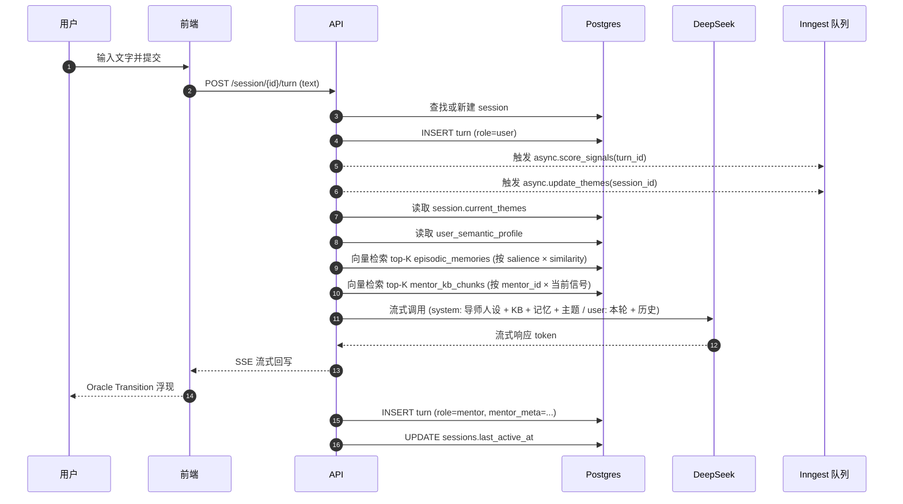
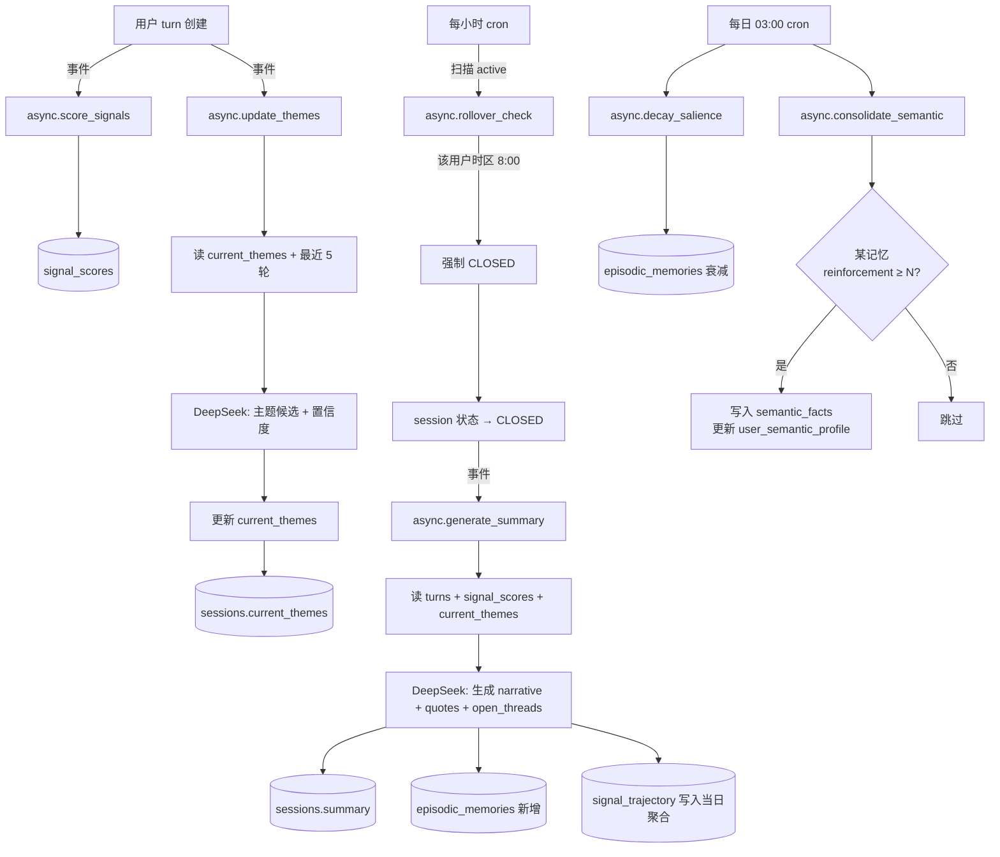

# 15 Signals · 数据流图

**版本：** 0.1
**日期：** 2026-05-21
**用途：** 描述从用户输入到记忆持久化的完整数据流，串起所有同步/异步任务。

---

## 一、宏观分层

```
┌────────────────────────────────────────────────────────────────┐
│  端 (Web / iOS)                                                │
│  ├─ 渲染：导师画像、对话流、4 场景状态机                       │
│  └─ 仅发送/接收文本与会话事件                                  │
└────────────────────────────────────────────────────────────────┘
                            ↕
┌────────────────────────────────────────────────────────────────┐
│  API 层 (FastAPI)                                              │
│  ├─ 同步：会话管理、消息接收、流式响应                         │
│  └─ 异步触发：信号评分、主题重评、记忆抽取、总结生成           │
└────────────────────────────────────────────────────────────────┘
                            ↕
┌──────────────────────┐  ┌──────────────────────┐  ┌────────────┐
│  Postgres + pgvector │  │  Inngest (任务队列)  │  │  LLM/Embed │
│  - 业务数据          │  │  - 评分/主题/总结    │  │  - DeepSeek  │
│  - 向量检索          │  │  - 跨日强制关闭      │  │  - Voyage  │
└──────────────────────┘  └──────────────────────┘  └────────────┘
                            ↕
                          [Langfuse] 追踪所有 LLM 调用
```

---

## 二、同步路径：一条用户输入的完整往返



### 关键设计点

| 设计 | 原因 |
|------|------|
| 信号评分**不阻塞回应** | 用户体验优先；评分用于下一次对话开场和长期趋势，不需要本轮可见 |
| 主题重评**异步且节流** | 见 spec §9.5，每 3 轮才触发一次 |
| 向量检索发生在 API 层 | 集中在 Postgres 内完成，单次请求一个数据源，避免双写 |
| 流式回写 (SSE) | 配合"Thinking → Response"的呼吸节奏，token 逐字浮现 |

---

## 三、异步任务图谱



---

## 四、关键任务的详细流程

### 4.1 信号评分 `async.score_signals(turn_id)`

```
1. 读 turn.content
2. 调用 DeepSeek (system: rubric-v0.1 + 锚点示例 [缓存]) 
                (user: turn.content)
3. 解析 JSON，校验 15 字段都在 [0,1]
4. INSERT signal_scores (turn_id, user_id, 15 维, scorer 元数据)
5. 写 Langfuse trace
```

**SLA**：< 3 秒
**失败处理**：重试 3 次后写入 null + flag，不阻塞后续

### 4.2 主题重评 `async.update_themes(session_id)`

```
1. 节流：检查上次执行时间，<5 分钟内或本会话 turn_count 未达 +3 → skip
2. 读最近 5 轮 turns
3. 读当前 session.current_themes
4. 调用 DeepSeek：
   input: 最近对话 + 现有主题
   output: 候选主题 [{keyword, confidence}]
5. 合并算法：
   a) 候选与现有语义相近 → 提升 confidence
   b) 候选新增且 confidence > 0.6 → 加入候选池
   c) 现有主题 last_reinforced_turn 距 turn_count > 4 → 衰减
   d) 排序取 Top 3
6. UPDATE sessions.current_themes
```

### 4.3 总结生成 `async.generate_summary(session_id)`

```
1. 读完整 turns + signal_scores + current_themes
2. 调用 DeepSeek (主对话用 deepseek-chat)：
   生成 {narrative, themes_final, signal_snapshot, salient_quotes, open_threads}
3. UPDATE sessions.summary
4. INSERT episodic_memories：
   - 每条 salient_quote → 一条 type='quote'
   - 每条 open_thread → 一条 type='open_thread'
   - narrative → 一条 type='pattern'（可选）
5. 为每条新记忆生成 embedding（Voyage）
6. UPSERT signal_trajectory：写当日 daily_avg / max / count
7. 重算 rolling_7d / 14d / slope_7d
```

**SLA**：< 30 秒（不可见，可慢）

### 4.4 跨日强制关闭 `async.rollover_check`

```
每小时 cron 触发：
  SELECT id, user_id FROM sessions
  WHERE status = 'active'
    AND last_active_at < now() - interval '5 minutes'  -- 宽限期
    AND date_trunc('hour', now() AT TIME ZONE u.timezone) = '08:00'
    AND date_trunc('day', last_active_at AT TIME ZONE u.timezone)
        < date_trunc('day', now() AT TIME ZONE u.timezone);

For each:
  UPDATE status = 'closed_by_rollover', closed_at = now()
  触发 async.generate_summary(session_id)
```

### 4.5 显著度衰减 `async.decay_salience`

```
每日 03:00 cron：
  UPDATE episodic_memories
  SET current_salience = current_salience * 0.95
  WHERE deleted_at IS NULL
    AND last_reinforced_at < now() - interval '7 days';

  -- 低于阈值的记忆从主检索池退出（不删除，可恢复）
  -- 由查询时的 WHERE current_salience > 0.1 控制
```

### 4.6 语义巩固 `async.consolidate_semantic`

```
每日 03:30 cron：
  FOR each user WITH new episodic_memories since last_consolidated_at:
    1. 找出 reinforcement_count >= 3 且 consolidated_to_semantic = false 的记忆
    2. LLM 将这些记忆提炼为 semantic_facts（或与现有 facts 合并）
    3. UPDATE episodic_memories.consolidated_to_semantic = true
    4. 重新生成 user_semantic_profile.profile JSON
    5. UPDATE user_semantic_profile.version++
```

---

## 五、跨服务的数据契约

### LLM 调用的 system prompt 结构（缓存策略）

DeepSeek 自动启用 prompt caching（服务端检测公共前缀，无需显式标记）。
为了最大化命中率，**保证 system prompt 的前缀稳定**，把变化的部分放后面。

```
[最稳定 · 跨会话不变]
  导师人设 + 风格指南 + forbidden_moves   (~3000 tokens)

[半稳定 · 每次会话开始时构建一次，会话内不变]
  user_semantic_profile.profile           (~500 tokens)
  + 召回的 top-K episodic_memories        (~1500 tokens)

[每轮变化]
  本轮召回的 top-K mentor_kb_chunks       (~2000 tokens)
  + 当前 session 的 turns 历史
  + 本轮 user 输入
```

预期：DeepSeek 缓存命中价格约为非缓存的 1/10，等效成本降到原先的 ~30%。

### Inngest 事件类型

| 事件名 | 触发源 | 消费者 |
|--------|--------|--------|
| `turn.user.created` | API 写入 turn 后 | `score_signals`, `update_themes` |
| `session.closed` | API 关闭 session 后 | `generate_summary` |
| `cron.hourly` | Inngest 定时 | `rollover_check` |
| `cron.daily_3am` | Inngest 定时 | `decay_salience` |
| `cron.daily_330am` | Inngest 定时 | `consolidate_semantic` |

---

## 六、可观测性

每次 LLM 调用必须记录 (Langfuse trace)：
- input prompt（含缓存命中信息）
- output 完整响应
- 模型版本、temperature、latency、token 数
- 关联的 session_id / turn_id / user_id

每个异步任务必须记录 (Inngest dashboard)：
- 触发时间、完成时间
- 输入参数、输出结果
- 失败重试次数

---

## 七、读路径与写路径的对照

| 路径 | 数据库表 | 触发 |
|------|---------|------|
| **每轮回应（读）** | sessions, user_semantic_profile, episodic_memories (向量), mentor_kb_chunks (向量) | 用户提交 |
| **每轮回应（写）** | turns × 2（user + mentor） | 用户提交 + LLM 完成 |
| **评分（写）** | signal_scores | 异步 |
| **主题（读写）** | sessions.current_themes | 每 3 轮异步 |
| **总结（写）** | sessions.summary, episodic_memories, signal_trajectory | 会话关闭异步 |
| **巩固（读写）** | episodic_memories, semantic_facts, user_semantic_profile | 每日凌晨异步 |

---

## 八、待补充

- [ ] 错误降级策略：LLM 服务挂时的 graceful degradation
- [ ] 评分 / 主题任务的去重：避免短时重复触发
- [ ] 用户主动删除记忆 / 数据导出 / GDPR 流
- [ ] 多端同步：同一用户在 Web 与 iOS 并发会话的冲突处理
